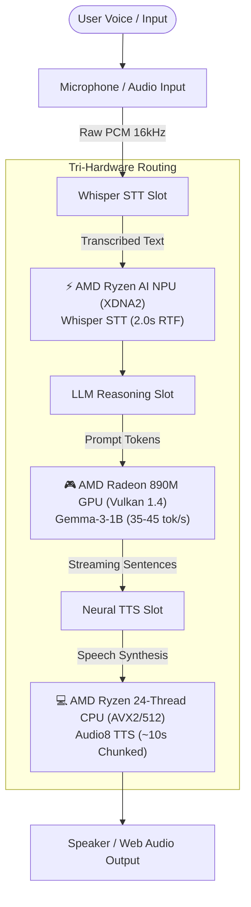

# ⚡ Alveare 3.0: Tri-Hardware Heterogeneous Concurrent Execution

Alveare 3.0 breaks the single-device paradigm by introducing **Tri-Hardware Concurrent Execution**. A single AMD Ryzen AI Mini PC can now simultaneously run three independent AI models across its three distinct silicon engines:



---

## 🎯 The Tri-Hardware Optimal Partition

Running multiple models concurrently on a compact unified-memory PC requires careful hardware partitioning to avoid resource contention and thermal throttling:

| Engine Slot | Target Hardware | Why This Hardware? | Memory Footprint |
|---|---|---|---|
| **LLM Chat** | **AMD Radeon 890M GPU** | Maximum memory bandwidth and subgroup parallelism allow 35–45+ tok/s token streaming without CPU overhead. | ~1.5–3.5 GB VRAM |
| **Whisper STT** | **AMD Ryzen AI NPU** | Continuous audio feature extraction and listening runs in background without touching GPU cores or stealing VRAM. | Dedicated SRAM + ~200 MB DRAM |
| **Audio8 TTS** | **AMD Ryzen CPU** | 24 threads with AVX-512 vectorization synthesize speech chunks in parallel with zero GPU contention. | ~400 MB Host RAM |

---

## 🏗️ Architecture: Independent Model Slots

In `runtime/py/control_server.py`, the backend maintains three isolated execution slots:

- `slots["llm"]`: Manages the C++ inference engine process (`alveare_runtime`) on GPU, NPU, or CPU.
- `slots["stt"]`: Manages the background Whisper worker on NPU, GPU, or CPU.
- `slots["tts"]`: Manages the background Audio8 neural TTS worker on CPU, GPU, or NPU.

Each slot has its own independent lifecycle:
- Starting or stopping one slot does **not** interrupt or restart other running slots.
- Telemetry monitors each device independently (NPU utilization via XRT, GPU utilization & VRAM via Linux sysfs, CPU load via psutil).

---

## 🔌 REST API Endpoints for Slots

### Start a Specific Model Slot
`POST /api/control/slot/start`
```json
{
  "slot_type": "llm",
  "model": "gemma3",
  "device": "gpu"
}
```

### Stop a Specific Model Slot
`POST /api/control/slot/stop`
```json
{
  "slot_type": "stt"
}
```

### Start Coordinated Tri-Hardware Live Profile
`POST /api/live/start`
```json
{
  "llm_model": "gemma3",
  "llm_device": "gpu",
  "stt_model": "whisper-base",
  "stt_device": "npu",
  "tts_model": "audio8-0.1b",
  "tts_device": "cpu"
}
```

### Check Slot Status and Telemetry
`GET /api/status`
Returns status for each slot (`llm`, `stt`, `tts`), GPU usage (`percent`, `vram_used_mb`, `vram_total_mb`), and NPU usage.

---

## 💻 CLI Usage

```bash
# Serve LLM on GPU
./alveare serve gemma3 --device gpu

# Serve LLM on NPU
./alveare serve gemma4 --device npu

# Serve LLM on CPU
./alveare serve gemma3 --device cpu

# Launch the interactive full-duplex live session using all three engines
./alveare live
```
