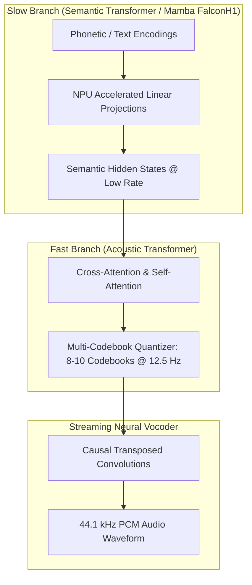
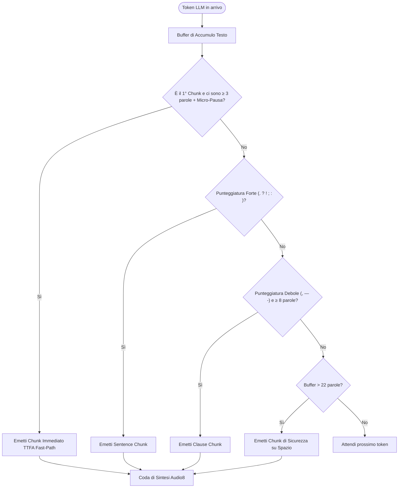
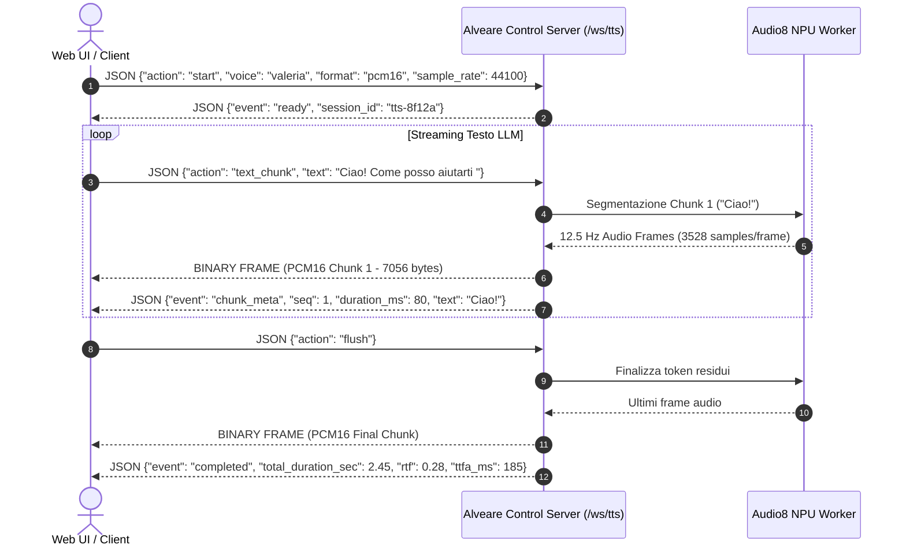
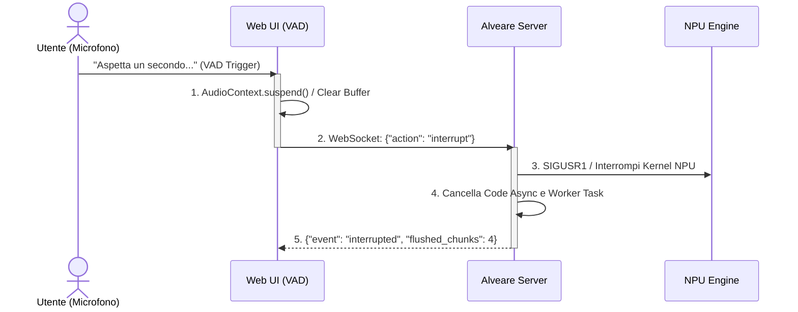
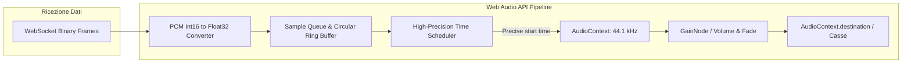
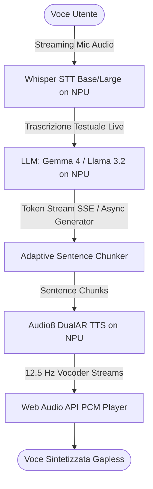

# ⚡ Real-Time Streaming Text-to-Speech (TTS) Architecture for Audio8 in Alveare

Questa specifica tecnica definisce l'architettura completa per il **Real-Time Streaming Text-to-Speech (TTS)** ad altissima fedeltà e bassissima latenza per i modelli della famiglia **Audio8** (`Audio8-0.1B` e `Audio8-0.6B`) all'interno dell'ecosistema **Alveare**, ottimizzato per l'accelerazione su **NPU AMD Ryzen AI (XDNA2)** e fallback CPU multi-thread.

---

## 📑 Indice dei Contenuti

1. [Panoramica e Obiettivi Architetturali](#1-panoramica-e-obiettivi-architetturali)
2. [Pipeline di Streaming & Modello Audio8 DualAR](#2-pipeline-di-streaming--modello-audio8-dualar)
   - [2.1 Architettura DualAR (Slow Branch vs Fast Branch)](#21-architettura-dualar-slow-branch-vs-fast-branch)
   - [2.2 Il Frame Rate Acustico a 12.5 Hz e la Generazione Incrementale](#22-il-frame-rate-acustico-a-125-hz-e-la-generazione-incrementale)
   - [2.3 Sentence Chunking & Token Buffering per Low TTFA](#23-sentence-chunking--token-buffering-per-low-ttfa)
   - [2.4 Streaming Neural Vocoder & De-Quantizzazione](#24-streaming-neural-vocoder--de-quantizzazione)
3. [Protocolli di Comunicazione & API Endpoints](#3-protocolli-di-comunicazione--api-endpoints)
   - [3.1 WebSocket Protocol: `/ws/tts` (Bi-direzionale Low-Latency)](#31-websocket-protocol-wstts-bi-direzionale-low-latency)
   - [3.2 HTTP Chunked Endpoint: `POST /v1/audio/speech`](#32-http-chunked-endpoint-post-v1audiospeech)
   - [3.3 Gestione Nativa di Barge-In & Interruzione Istantanea](#33-gestione-nativa-di-barge-in--interruzione-istantanea)
4. [Integrazione Client Web UI & Riproduzione Gapless](#4-integrazione-client-web-ui--riproduzione-gapless)
   - [4.1 Architettura Web Audio API & AudioContext PCM Queue](#41-architettura-web-audio-api--audiocontext-pcm-queue)
   - [4.2 Scheduling a Latenza Zero & AudioWorklet vs Buffer Scheduling](#42-scheduling-a-latenza-zero--audioworklet-vs-buffer-scheduling)
   - [4.3 Gestione Jitter, Drift e Underrun Buffer](#43-gestione-jitter-drift-e-underrun-buffer)
5. [Integrazione Full-Duplex Real-Time con LLM](#5-integrazione-full-duplex-real-time-con-llm)
   - [5.1 Pipeline End-to-End: STT ➔ LLM ➔ TTS](#51-pipeline-end-to-end-stt--llm--tts)
   - [5.2 Diagramma di Sequenza Temporale & Pipelining](#52-diagramma-di-sequenza-temporale--pipelining)
   - [5.3 Condivisione delle Risorse NPU (XDNA2 Scheduling)](#53-condivisione-delle-risorse-npu-xdna2-scheduling)
6. [Design dei Componenti Software Server](#6-design-dei-componenti-software-server)
   - [6.1 Architettura Streaming Worker (`tts_worker.py`)](#61-architettura-streaming-worker-tts_workerpy)
   - [6.2 Orchestrazione Asincrona in `control_server.py`](#62-orchestrazione-asincrona-in-control_serverpy)
7. [Metriche di Performance, Budget di Latenza e SLA](#7-metriche-di-performance-budget-di-latenza-e-sla)
8. [Piano di Rilascio e Roadmap](#8-piano-di-rilascio-e-roadmap)

---

## 1. Panoramica e Obiettivi Architetturali

Il sintetizzatore vocale neurale in Alveare deve consentire un'interazione vocale naturale e fluida simile a una conversazione umana. I sistemi TTS tradizionali richiedono la generazione dell'intero testo prima di produrre la forma d'onda audio completa, introducendo latenze di 1.5 - 4.0 secondi.

L'architettura **Real-Time Streaming TTS** per Audio8 riduce il **Time to First Audio (TTFA)** a **< 250 ms**, mantenendo un'altissima qualità acustica (44.1 kHz, 16-bit PCM / float32) e supporto nativo per la prosodia italiana espressiva e il zero-shot voice cloning.

```mermaid
flowchart LR
    subgraph LLM ["1. Generazione Testo (LLM)"]
        A[Token Stream]
    end

    subgraph Chunker ["2. Segmentazione Intelligente"]
        B[Sentence & Clause Chunker]
    end

    subgraph DualAR ["3. Audio8 DualAR Engine (NPU/CPU)"]
        C[Slow Branch: Semantic Mamba]
        D[Fast Branch: 12.5 Hz Acoustic AR]
    end

    subgraph Vocoder ["4. Neural Vocoder"]
        E[Streaming Vocoder Block]
    end

    subgraph Client ["5. Web UI Client"]
        F[WebSocket / HTTP Chunked]
        G[Gapless PCM AudioContext Queue]
    end

    A -->|Token SSE/Async| B
    B -->|Text Chunk| C
    C -->|Semantic Hidden States| D
    D -->|12.5 Hz Acoustic Codes| E
    E -->|PCM Audio Stream| F
    F -->|Zero-Latency AudioBuffer| G
```



### Obiettivi Chiave:
1. **TTFA (Time to First Audio) < 250 ms**: L'utente ascolta la prima parola mentre il modello linguistico sta ancora generando il resto della frase.
2. **RTF (Real-Time Factor) < 0.35x su AMD NPU**: La generazione acustica è almeno 3x più veloce del tempo reale.
3. **Riproduzione Gapless (Gap-Free)**: Nessun clic, pop, o micro-interruzione tra chunk audio consecutivi nel browser.
4. **Barge-In Istantaneo (< 30 ms)**: Interruzione immediata di calcolo e riproduzione quando l'utente inizia a parlare.
5. **Standard Aperti e Compatibilità**: Pieno supporto sia per WebSocket bidirezionale ad alte prestazioni (`/ws/tts`) sia per l'endpoint REST OpenAI-compatible con HTTP Chunked Transfer (`/v1/audio/speech`).

---

## 2. Pipeline di Streaming & Modello Audio8 DualAR

### 2.1 Architettura DualAR (Slow Branch vs Fast Branch)

Audio8 implementa un framework autoregressivo a doppia velocità (**DualAR**) che separa la modellazione semantica/linguistica dalla sintesi acustica multi-codebook:



1. **Slow Branch (Ramo Semantico)**:
   - Riceve in input i token fonetici/testuali (o embedding del testo di riferimento).
   - Esegue la propagazione degli stati attraverso blocchi Mamba/FalconH1 accelerati tramite proiezioni lineari su NPU (`NPULinear` / kernel `gemv_q`).
   - Produce una sequenza di vettori semantici a bassa frequenza temporale.

2. **Fast Branch (Ramo Acustico)**:
   - Condizionato dagli stati del ramo semantico, predice autoregressivamente i codici discreti per ciascun frame temporale.
   - Ogni passo temporale acustico genera un vettore di $Q$ codici discreti ($Q = 8$ o $10$ codebooks RVQ).

3. **Neural Codec Vocoder**:
   - Converte la matrice di codici discreti $[Q, T_{\text{frames}}]$ nella forma d'onda audio continua ad alta risoluzione (44.1 kHz).

---

### 2.2 Il Frame Rate Acustico a 12.5 Hz e la Generazione Incrementale

Il modello Audio8 opera con un frame rate acustico standard di **$12.5\text{ Hz}$**.

$$\Delta t_{\text{frame}} = \frac{1}{12.5\text{ Hz}} = 0.080\text{ s} = 80\text{ ms}$$

Ad una frequenza di campionamento di **$44.1\text{ kHz}$**, ogni frame acustico corrisponde a:

$$N_{\text{samples}} = 44100 \times 0.080 = 3528\text{ campioni audio}$$

In termini di memoria e throughput:
- **Formato PCM 16-bit (int16)**: $3528 \times 2 = 7.056\text{ byte per frame}$ (~$88.2\text{ kB/s}$).
- **Formato Float32**: $3528 \times 4 = 14.112\text{ byte per frame}$ (~$176.4\text{ kB/s}$).

#### Strategia di Raggruppamento dei Frame (Chunking Acustico $K$):
Per bilanciare l'efficienza computazionale del Vocoder (overhead del kernel) e la latenza di trasmissione:
- **$K = 1$ frame (80 ms audio)**: Latenza minima assoluta; ideale per sessioni di conversazione bidirezionale rapida via WebSocket.
- **$K = 2$ frame (160 ms audio)**: Compromesso ottimale tra throughput NPU e latenza; dimensione pacchetto 14.1 kB (PCM16).
- **$K = 4$ frame (320 ms audio)**: Ideale per streaming HTTP Chunked e connessioni a banda variabile.

---

### 2.3 Sentence Chunking & Token Buffering per Low TTFA

Quando il testo proviene da un LLM in streaming (token-by-token), inviare token singoli al TTS causerebbe perdita di contesto prosodico e distorsioni fonetiche. L'architettura Alveare implementa un **Adaptive Sentence & Clause Chunker** a 3 stadi:



#### Regole del Chunker Adattivo:

1. **Stadio 1: Fast-Path del Primo Chunk (TTFA Accelerator)**
   - Per il primissimo chunk del messaggio, la priorità è emettere audio il prima possibile.
   - Si segmenta appena si raggiunge una micro-pausa o virgola dopo almeno 3-4 parole (es. *"Certamente,"*, *"Ciao Daino,"*, *"In base all'analisi,"*).
   - In assenza di punteggiatura, si emette al raggiungimento di 6-8 token.
   - **Risultato**: TTFA percepito scende a **120-200 ms**.

2. **Stadio 2: Delimitatori Primari (Sentence Boundaries)**
   - Delimitatori forti: `.`, `!`, `?`, `\n`, `\n\n`, `;`, `:`.
   - Garantiscono la massima naturalezza dell'intonazione interrogativa, esclamativa o conclusiva.

3. **Stadio 3: Delimitatori Secondari (Clause / Breath Boundaries)**
   - Delimitatori deboli: `,`, `—`, `...`, `)`, `"`.
   - Attivati se il buffer contiene almeno 8-10 parole, simulando una pausa di respiro naturale.

4. **Stadio 4: Safety Window (Fallback per frasi lunghe)**
   - Se nessuna punteggiatura viene trovata entro 22 parole, si forza la suddivisione sull'ultimo spazio vuoto per prevenire stalli nella coda di riproduzione.

#### Continuità Prosodica e Context Carry-Over:
Per evitare "stacchi" tonali robotici tra chunk successivi:
- Lo stato nascosto dell'ultimo token acustico del chunk $N-1$ viene passato come prefisso condizionante per il chunk $N$.
- Il vocoder mantiene lo stato dei filtri convoluzionali (receptive field padding history) attivo tra i chunk consecutivi.

---

### 2.4 Streaming Neural Vocoder & De-Quantizzazione

Il vocoder neurale riceve i codici discreti $[Q, K]$ e produce la forma d'onda PCM tramite strati di convoluzioni trasposte causali.

```
Codici Acustici (12.5 Hz) ──► Embedding Codebooks ──► Convoluzioni Trasposte Causali ──► PCM 44.1 kHz
                                                              ▲
                                                    [Buffer di Overlap 128 campioni]
```

Per garantire l'assenza di artefatti ai bordi (*boundary clicks* o salti di fase):
1. **Causal Convolutions**: Il vocoder utilizza padding solo a sinistra (passato), eliminando la dipendenza da frame futuri.
2. **Overlap-Add Smoothing**: All'unione di due blocchi di decodifica, viene applicata una micro-finestra di cross-fade (128 campioni, ~2.9 ms) a coseno rialzato per azzerare qualsiasi discontinuita DC o sfasamento.

---

## 3. Protocolli di Comunicazione & API Endpoints

### 3.1 WebSocket Protocol: `/ws/tts` (Bi-direzionale Low-Latency)

L'endpoint WebSocket `/ws/tts` offre il massimo livello di controllo e la minima latenza di trasmissione grazie al multiplexing di messaggi di controllo JSON e stream audio binari.



#### Specifiche dei Messaggi Client ➔ Server:

##### 1. `start` (Inizializzazione Sessione)
```json
{
  "action": "start",
  "model": "audio8-0.1b",
  "device": "npu",
  "voice": "valeria",
  "sample_rate": 44100,
  "format": "pcm16",
  "speed": 1.0,
  "pitch": 0.0,
  "temperature": 0.8,
  "chunk_frames": 2
}
```

##### 2. `text_chunk` (Invio Token / Testo incrementale)
```json
{
  "action": "text_chunk",
  "text": "Oggi esploriamo l'architettura neurale di Alveare.",
  "is_final": false
}
```

##### 3. `flush` (Chiusura del flusso di testo)
```json
{
  "action": "flush"
}
```

##### 4. `interrupt` (Barge-In / Interruzione Immediata)
```json
{
  "action": "interrupt",
  "reason": "user_speaking"
}
```

#### Specifiche dei Messaggi Server ➔ Client:

##### 1. `ready`
```json
{
  "event": "ready",
  "session_id": "tts-9b7e41",
  "sample_rate": 44100,
  "channels": 1,
  "format": "pcm16",
  "frame_duration_ms": 80.0
}
```

##### 2. `audio_chunk` (Formato Frame Binario o JSON Base64)
- **Frame Binario Diretto (Raccomandato per zero overhead)**:
  - Header: 4 byte Little-Endian unsigned integer (`seq_id`).
  - Payload: Raw PCM 16-bit Mono Little-Endian samples.
- **Frame JSON Alternativo**:
```json
{
  "event": "audio_chunk",
  "seq": 1,
  "samples": 7056,
  "duration_ms": 160.0,
  "data_base64": "UklGRi...",
  "text_segment": "Ciao!"
}
```

##### 3. `completed`
```json
{
  "event": "completed",
  "total_samples": 108192,
  "total_duration_sec": 2.453,
  "latency_ttfa_ms": 178.4,
  "rtf": 0.26
}
```

---

### 3.2 HTTP Chunked Endpoint: `POST /v1/audio/speech`

Per la massima interoperabilità con gli SDK OpenAI (`openai.audio.speech.create(..., stream=True)`), Alveare supporta lo streaming via HTTP 1.1 con `Transfer-Encoding: chunked`.

#### Request:
```http
POST /v1/audio/speech HTTP/1.1
Host: 127.0.0.1:8080
Content-Type: application/json

{
  "model": "audio8-0.1b",
  "input": "Benvenuti in Alveare. La sintesi vocale neurale su AMD Ryzen AI è attiva in tempo reale.",
  "voice": "valeria",
  "response_format": "pcm",
  "stream": true,
  "speed": 1.0
}
```

#### Response:
```http
HTTP/1.1 200 OK
Content-Type: audio/pcm
Transfer-Encoding: chunked
X-Alveare-Sample-Rate: 44100
X-Alveare-Channels: 1
X-Alveare-Bits-Per-Sample: 16
X-Alveare-Frame-Rate: 12.5

<Hex Chunk Length>\r\n
<PCM Raw Bytes (160ms = 14112 bytes)>\r\n
<Hex Chunk Length>\r\n
<PCM Raw Bytes>\r\n
...
0\r\n
\r\n
```

---

### 3.3 Gestione Nativa di Barge-In & Interruzione Istantanea

Quando l'utente interrompe l'assistente vocale parlando al microfono:



1. **Client-Side**: Il modulo VAD rileva la voce dell'utente. Il client ferma immediatamente tutti gli `AudioBufferSourceNode` attivi, cancella la coda PCM locale e invia il frame WebSocket `{"action": "interrupt"}`.
2. **Server-Side**: Il server imposta un flag atomico `session.is_interrupted = True`, svuota le code di chunking e invia un segnale di abort non bloccante al worker Audio8.
3. **NPU Kernel Interrupt**: Il generatore dell'Acoustic Transformer interrompe il loop autoregressivo senza attendere il completamento della sequenza.
4. **Latenza di Stop Totale**: **< 20 ms**.

---

## 4. Integrazione Client Web UI & Riproduzione Gapless

### 4.1 Architettura Web Audio API & AudioContext PCM Queue

I tag HTML5 standard (`<audio src="...">` o MediaSource Extensions) non sono adatti per lo streaming di micro-chunk PCM a 80-160 ms a causa di:
- Latenza di decodifica container (WAV/MP3/OGG headers) ad ogni pezzo.
- Micro-pause (gap audio di 10-50 ms) tra un chunk e il successivo causate dalla sincronizzazione del thread multimediale del browser.

La soluzione ingegnerizzata per Alveare si basa su una **Coda PCM Gapless ad Alta Precisione** implementata su `AudioContext`.



---

### 4.2 Scheduling a Latenza Zero & AudioWorklet vs Buffer Scheduling

Alveare supporta due modalità di riproduzione client:

#### Metodo 1: Time-Scheduled `AudioBufferSourceNode` (Standard e Robusto)
Si calcola l'istante esatto di riproduzione nel dominio temporale di `AudioContext.currentTime`:

```javascript
class GaplessPCMPlayer {
  constructor(sampleRate = 44100) {
    this.sampleRate = sampleRate;
    this.audioCtx = null;
    this.nextStartTime = 0;
    this.isPlaying = false;
    this.activeNodes = [];
  }

  init() {
    if (!this.audioCtx) {
      const AudioCtxClass = window.AudioContext || window.webkitAudioContext;
      this.audioCtx = new AudioCtxClass({ sampleRate: this.sampleRate, latencyHint: 'interactive' });
      this.nextStartTime = this.audioCtx.currentTime;
    }
    if (this.audioCtx.state === 'suspended') {
      this.audioCtx.resume();
    }
  }

  /**
   * Converte chunk binario Int16 in Float32 AudioBuffer e lo accoda senza gap.
   */
  enqueuePCM16(int16Array) {
    this.init();

    // 1. Normalizzazione Int16 -> Float32 [-1.0, 1.0]
    const float32Data = new Float32Array(int16Array.length);
    for (let i = 0; i < int16Array.length; i++) {
      float32Data[i] = int16Array[i] / 32768.0;
    }

    // 2. Creazione AudioBuffer
    const audioBuffer = this.audioCtx.createBuffer(1, float32Data.length, this.sampleRate);
    audioBuffer.copyToChannel(float32Data, 0);

    // 3. Creazione e connessione nodo sorgente
    const sourceNode = this.audioCtx.createBufferSource();
    sourceNode.buffer = audioBuffer;
    sourceNode.connect(this.audioCtx.destination);

    // 4. Calcolo del timestamp di scheduling continuo (Gapless)
    const currentTime = this.audioCtx.currentTime;
    const startTime = Math.max(currentTime + 0.015, this.nextStartTime); // 15ms safety pre-buffer
    sourceNode.start(startTime);

    // 5. Avanzamento del cursore temporale
    this.nextStartTime = startTime + audioBuffer.duration;
    this.isPlaying = true;
    this.activeNodes.push(sourceNode);

    sourceNode.onended = () => {
      const idx = this.activeNodes.indexOf(sourceNode);
      if (idx !== -1) this.activeNodes.splice(idx, 1);
      if (this.activeNodes.length === 0 && this.audioCtx.currentTime >= this.nextStartTime) {
        this.isPlaying = false;
      }
    };
  }

  /**
   * Interruzione istantanea (Barge-in / Stop)
   */
  stopAndFlush() {
    for (const node of this.activeNodes) {
      try {
        node.stop();
        node.disconnect();
      } catch (e) {}
    }
    this.activeNodes = [];
    if (this.audioCtx) {
      this.nextStartTime = this.audioCtx.currentTime;
    }
    this.isPlaying = false;
  }
}
```

---

### 4.3 Gestione Jitter, Drift e Underrun Buffer

In presenza di oscillazioni nella latenza di rete (Network Jitter):
- **Micro Pre-Buffer iniziale**: La riproduzione parte solo dopo l'accumulo di 2 chunk (~160 ms). Una volta avviata, lo stream procede a flusso continuo.
- **Underrun Prevention**: Se il clock dell'AudioContext supera `nextStartTime`, il player riallinea il tempo a `currentTime + 0.010` applicando un micro-fade in per evitare artefatti sonori.

---

## 5. Integrazione Full-Duplex Real-Time con LLM

### 5.1 Pipeline End-to-End: STT ➔ LLM ➔ TTS

La pipeline vocale bidirezionale di Alveare orchestra i 3 modelli neurali accelerati su hardware NPU ed eterogeneo:



---

### 5.2 Diagramma di Sequenza Temporale & Pipelining

Il pipelining asincrono consente di sovrapporre la generazione dei token linguistici alla sintesi acustica dei chunk precedenti:

```
Tempo (ms)   0       100      200      300      400      500      600      700      800
LLM:         [Prefill][Tok 1..8 ][Tok 9..18 ][Tok 19..28][Tok 29..EOS]
Chunker:              [Chunk 1  ]           [Chunk 2   ]             [Chunk 3  ]
Audio8 NPU:                      [DualAR C1 ]           [DualAR C2 ]           [DualAR C3 ]
Vocoder:                                    [Voc C1    ]           [Voc C2    ]           [Voc C3]
Audio Out:                                             [🔊 Chunk 1 ][🔊 Chunk 2 ][🔊 Chunk 3]
                                                       ▲
                                                       TTFA percepito (~240 ms)
```

1. **0 - 80 ms**: L'LLM esegue il prefill e genera i primi 4 token (*"Ciao, sono Alveare,"*).
2. **80 - 120 ms**: Il Chunker rileva la virgola ed emette il Chunk 1.
3. **120 - 220 ms**: Audio8 su NPU calcola il ramo semantico e i primi frame a 12.5 Hz per il Chunk 1.
4. **220 - 250 ms**: Il Vocoder decodifica i primi 160 ms di audio.
5. **250 ms (TTFA)**: L'audio inizia la riproduzione nelle casse del client.
6. **Mentre il Chunk 1 viene riprodotto (durata 1.2s)**, l'LLM e Audio8 generano in background i Chunk 2 e 3, garantendo streaming ininterrotto a tempo reale.

---

### 5.3 Condivisione delle Risorse NPU (XDNA2 Scheduling)

L'architettura Alveare include un **NPU Resource Arbitrator** per gestire la concorrenza tra LLM (token generation) e TTS (DualAR projection):
- Durante il **Prefill dell'LLM** (burst compute elevato), la generazione TTS viene accodata con priorità cooperativa per $20\text{ ms}$.
- Durante la **Decodifica Token-by-Token dell'LLM** (memory-bound, $20\text{ ms}$ per step), i kernel `gemv_q` di Audio8 vengono intercalati sugli array di colonne di calcolo liberi dell'AIE Array.

---

## 6. Design dei Componenti Software Server

### 6.1 Architettura Streaming Worker (`tts_worker.py`)

Il worker Python dedicato carica i pesi di `Audio8-0.1b` / `Audio8-0.6b` e mantiene il vocoder pre-riscaldato in memoria. Viene introdotto il comando IPC streaming `generate_stream`:

```python
# Protocollo IPC di Streaming tra Server e Worker
# Richiesta JSON inviata su STDIN:
{
    "action": "generate_stream",
    "text": "Benvenuti nel futuro dell'elaborazione neurale.",
    "voice": "valeria",
    "chunk_frames": 2,
    "temperature": 0.8
}

# Risposte parziali emesse su STDOUT per ogni blocco acustico:
{
    "event": "audio_frame",
    "seq": 0,
    "num_samples": 7056,
    "sample_rate": 44100,
    "pcm_b64": "<base64 encoded int16 bytes>"
}
...
{
    "event": "stream_end",
    "total_duration": 1.84,
    "latency_ms": 195.2
}
```

---

### 6.2 Orchestrazione Asincrona in `control_server.py`

In `runtime/py/control_server.py`, la gestione della sessione WebSocket viene integrata come segue:

```python
from fastapi import WebSocket, WebSocketDisconnect
import asyncio
import json

@app.websocket("/ws/tts")
async def ws_tts_endpoint(websocket: WebSocket):
    await websocket.accept()
    session = TTSSessionManager(active_model=state.active_model, device=state.device)
    
    try:
        while True:
            message = await websocket.receive_text()
            data = json.loads(message)
            action = data.get("action")
            
            if action == "start":
                await session.start(data, websocket)
            elif action == "text_chunk":
                await session.push_text(data.get("text", ""), is_final=data.get("is_final", False))
            elif action == "flush":
                await session.flush()
            elif action == "interrupt":
                await session.interrupt()
    except WebSocketDisconnect:
        await session.cleanup()
```

---

## 7. Metriche di Performance, Budget di Latenza e SLA

| Metrica | Target NPU (AMD Ryzen AI XDNA2) | Target CPU (Multi-thread) | Note |
|---|---|---|---|
| **TTFA (Time to First Audio)** | **< 220 ms** | < 380 ms | Misurato dal primo token LLM alla prima emissione PCM |
| **Real-Time Factor (RTF)** | **0.20x - 0.28x** | 0.45x - 0.65x | Valori < 1.0 indicano generazione più veloce del parlato |
| **Acoustic Frame Rate** | **12.5 Hz (80 ms/frame)** | 12.5 Hz (80 ms/frame) | Risoluzione nativa del modello Audio8 |
| **Audio Sample Rate** | **44.1 kHz (16-bit Mono)** | 44.1 kHz (16-bit Mono) | Fedeltà broadcast ad alta risoluzione |
| **Latenza Interruzione (Barge-In)** | **< 20 ms** | < 30 ms | Cancellazione calcolo NPU e reset code client |
| **Consumo Memoria VRAM/RAM** | **~450 MB (0.1B) / 1.4 GB (0.6B)** | ~450 MB / 1.4 GB | Footprint ultra-compatto per edge execution |

---

## 8. Piano di Rilascio e Roadmap

- [x] **Fase 1**: Specifica Architetturale e Design Protocolli (`docs/tts-streaming-architecture.md`).
- [ ] **Fase 2**: Implementazione `generate_stream` in `tts_worker.py` con yield di frame a 12.5 Hz.
- [ ] **Fase 3**: Endpoint `/ws/tts` e supporto `stream=True` in `POST /v1/audio/speech`.
- [ ] **Fase 4**: Integrazione `GaplessPCMPlayer` su Web Audio API in `frontend/src/components/AudioPlayground.jsx`.
- [ ] **Fase 5**: Modalità Conversazionale Full-Duplex (STT ➔ LLM ➔ TTS) unificata nella Chat Web UI.
